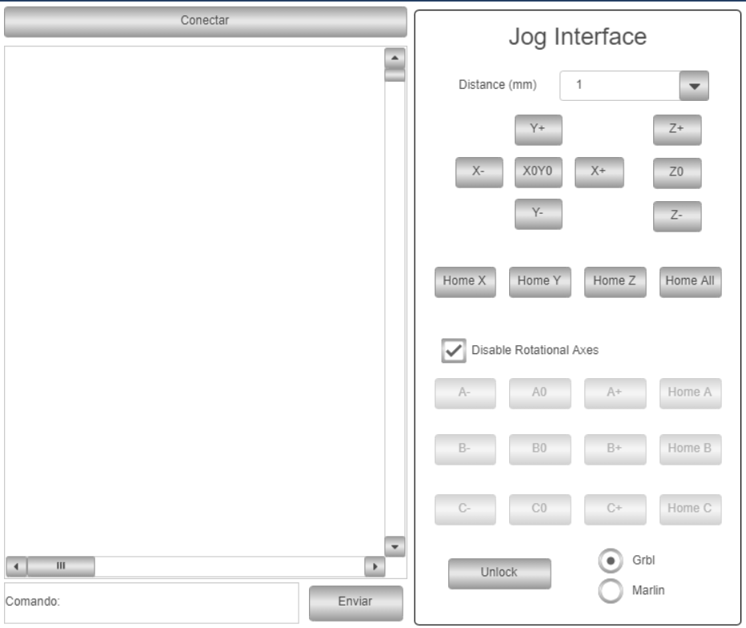

# RPi-Grbl
 Interface between GRBL and Codesys.

 Implemented on a Raspberry Pi, basic settings were done following this [tutorial](https://www.youtube.com/watch?v=wlDXS9jlqGY&list=PL17wZ5MdRpZ44TWyzDn7AJ8VuHsFrO9N5&index=16&ab_channel=CarlosAbner), and Codesys V3.5 SP17 Patch3
 
